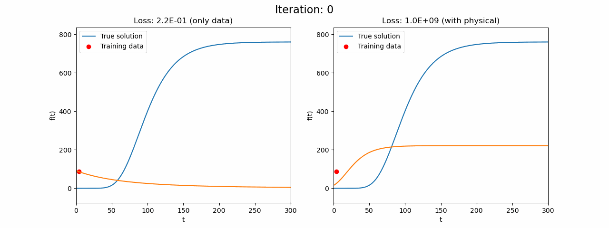
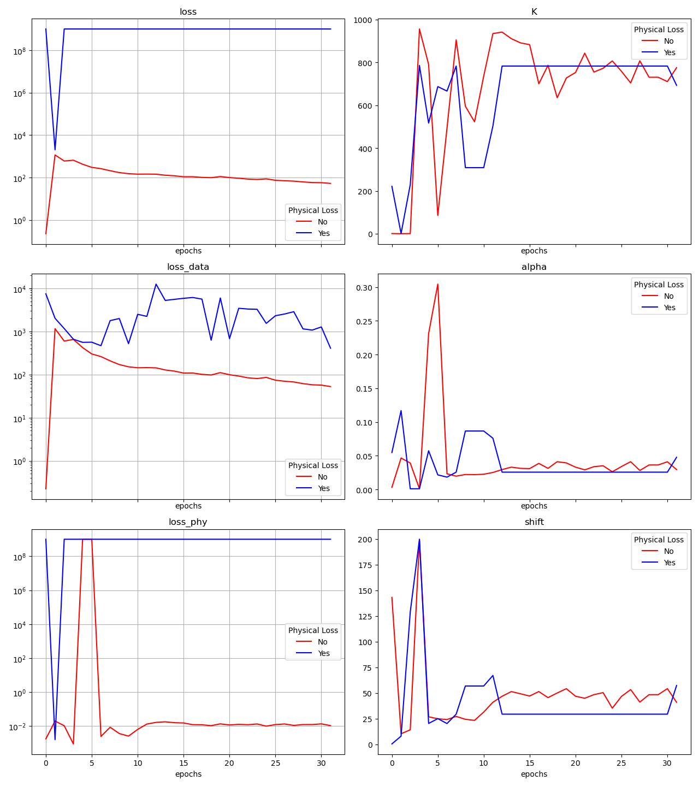

# Gompertz-Model
Gompertz curve optimization

## Model description

Equation of the Gompertz model:
$$\frac{\mathrm{d} f}{\mathrm{d} t} \left ( t \right ) = \alpha f(t) \ \mathrm{ln} \left ( \frac{K}{f(t)} \right )$$

With the solution: 

$$f(t) = K e^{\mathrm{ln} \left ( \frac{f_0}{K} \right ) e^{-\alpha t}}, \quad \mathrm{where} \quad f(t=0) = f_0$$

For physical usage, we add time shift parameter:

$$f(t) = K e^{\mathrm{ln} \left ( \frac{f_0}{K} \right ) e^{- \alpha \left ( t - t_{shift} \right )}}$$

## Numerical model

We define a set of training points $(t_i, f_i)_{i \in [1; N]}$.

For given parameters: $(K_{sim}, \alpha_{sim}, t_{shift,sim})$, we define the corresponding Gompertz function: $f_{(K_{sim}, \alpha_{sim}, t_{shift,sim})} = f_{sim}$

Residues of the differencial equation:

$$\frac{\mathrm{d} f_{sim}}{\mathrm{d} t} \left ( t \right ) - \alpha_{sim} f_{sim}(t) \ \mathrm{ln} \left ( \frac{K_{sim}}{f_{sim}(t)} \right ) = 0$$

which leads to the following error:

$$𝓛_{DE} = \frac{1}{M} \sum^{M}_{i=1} \left ( \frac{\mathrm{d} f_{sim}}{\mathrm{d} t} \bigg|_{t_i} - \alpha_{sim} f_{sim}(t_i) \ \mathrm{ln} \left ( \frac{K_{sim}}{f_{sim}(t_i)} \right ) \right ) ^ 2$$

And the classic error of the data, MSE of between the simulated data and the training ones:

$$𝓛_{sim} = \frac{1}{M} \sum^{M}_{i=1} \left ( f_i - f_{sim}(t_i) \right ) ^ 2$$

Finaly the loss is:

$$𝓛 = 𝓛_{sim} + 𝓛_{DE}$$

Then, the selection of $(K_{sim}, \alpha_{sim}, shif_{sim})$ is done using [Bayesian optimization](http://hyperopt.github.io/hyperopt/).

## Simulated data:

We use $N$ data generated with: 

$$\begin{cases}
f_0 = 16\\
K = 760\\
\alpha = 0.036\\
t_{shift} = 50
\end{cases}$$

and add some noise, a Gaussian distribution of standard deviation of 5% of $K$.

